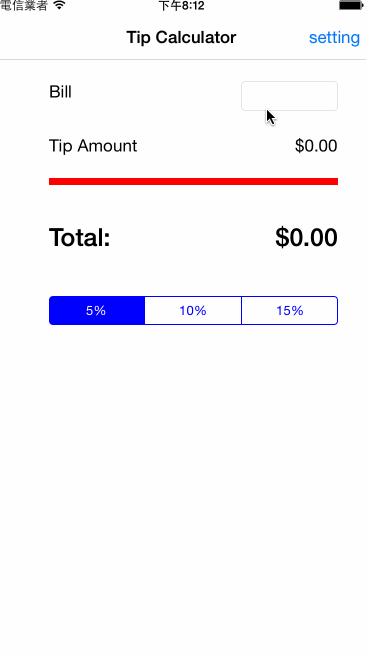

# TipCalculator

This is a Tip Calculator application for iOS submitted as the [pre-assignment](https://gist.github.com/timothy1ee/7747214) requirement for CodePath.

Time spent: 2 hours spent in total

Completed:

* [x] Required: User can enter a bill amount, choose a tip percentage, and see the tip and total values.
* [x] Required: Settings page to change the default tip percentage.
* [x] Optional: Using locale-specific currency and currency thousands separators.
* [x] Optional: User can change the background theme in the setting page.

GIF created with [LiceCap](http://www.cockos.com/licecap/).